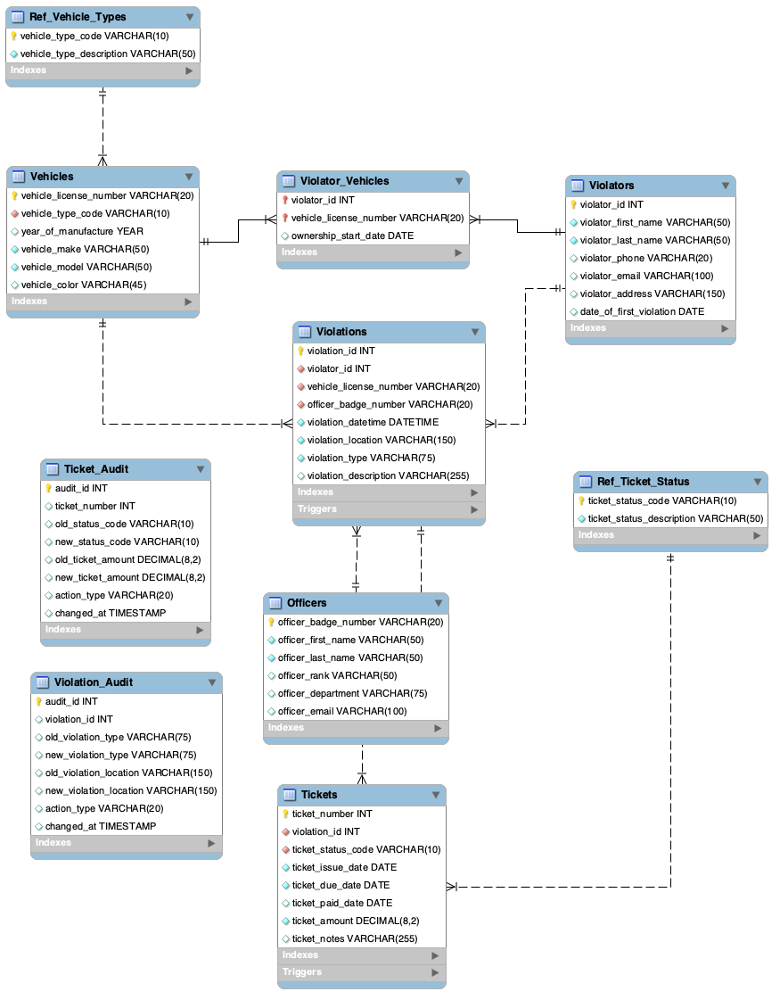

# Traffic Violation Management System

A relational database management system developed in **MySQL** featuring normalized database design, stored procedures, triggers, validation functions, indexing, auditing, and reporting.

---

## 📖 Project Overview

This project demonstrates the design and implementation of a relational database management system developed in MySQL to manage traffic violations, issued citations, vehicles, violators, and law enforcement officers.  

The database was designed using relational database normalization principles and incorporates primary and foreign key relationships to maintain data integrity and consistency across all entities.  

Beyond creating tables and relationships, the project implements advanced SQL features including stored procedures, validation functions, triggers, audit tables, and indexes.  These features work together to enforce business rules, improve query performance, maintain data accuracy, and automatically track changes made within the database.  

The project concludes with reporting queries that demonstrate how relational data can be retrieved, analyzed, and summarized to support operational and decision-making needs.  From the initial Entity Relationship Diagram (ERD) through implementation, validation, and reporting, the project highlights the complete process of designing, building, and documenting a functional relational database management system.

## 🗂️ Entity Relationship Diagram

The Entity Relationship Diagram (ERD) shows the structure of the database and the relationships between each entity.  The database uses primary and foreign keys to connect violators, vehicles, officers, violations, and tickets while lookup and junction tables help maintain consistent and organized data.

## ⭐ Key Features

- **Relational Database Design:** Designed and implemented a normalized database structure to manage traffic violations, tickets, vehicles, violators, officers, and supporting reference data.
- **Data Integrity & Validation:** Used primary and foreign keys, validation functions, and database constraints to maintain accurate and consistent records.
- **Automated Auditing:** Created audit tables and triggers to automatically track changes made to ticket and violation records.
- **Stored Procedures:** Developed stored procedures to support common database operations and improve consistency when working with stored data.
- **Indexing & Performance:** Implemented indexes on frequently accessed fields to support efficient data retrieval.
- **Reporting:** Created detailed and summary SQL reports to transform transactional data into useful information for reviewing traffic violation activity.

## 🛠️ Technologies & Skills

**Technologies:** MySQL, MySQL Workbench, SQL

**Database Skills:** Relational Database Design, ERD Development, DDL & DML, Primary & Foreign Keys, Indexing, Triggers, Stored Procedures, User-Defined Functions, Data Validation, Audit Tables, SQL Reporting

## 📁 Repository Contents

- **[Traffic_Violation_Management_System_Script.sql](Traffic_Violation_Management_System_Script.sql)** — Complete MySQL script containing the database schema, sample data, indexes, audit functionality, validation functions, stored procedures, and reporting queries.

- **[Traffic_Violation_Management_System_Report.pdf](documentation/Traffic_Violation_Management_System_Report.pdf)** — Full project report detailing the database design, implementation, testing, and results.

- **[final_erd.png](images/final_erd.png)** — Entity Relationship Diagram (ERD) illustrating the database structure and table relationships.

## 🎓 Project Context

Developed as a final project for Database Structures as part of my B.S. in Data Science & Analytics coursework. The project demonstrates the design and implementation of a complete relational database system using MySQL.
